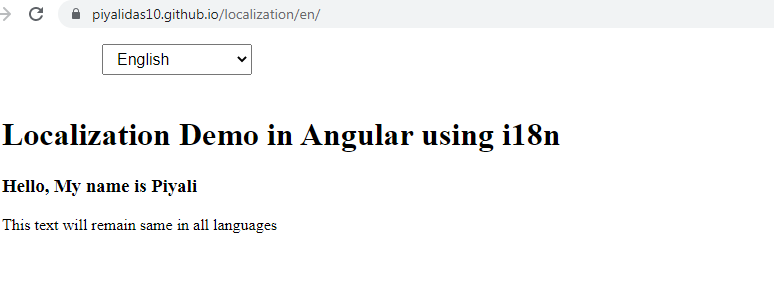
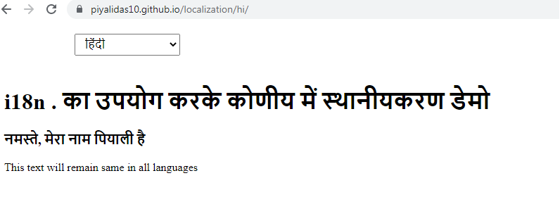
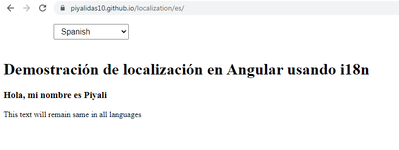

# Localization in Angular 10

Localization is the process of building versions of your app for different locales, including extracting text for translation into different languages, and formatting data for particular locales.

## Live Url

https://piyalidas10.github.io/localization/en/





## Run Application

At first run the following function to generate dist folder with different language folders
```
npm run build:prod
```

Run the command
```
http-server dist/localization
```

Check the http port number and run in browser using the port number
```
http://192.168.0.169:8081/
```
You will get the following folder. click any of them.
```
Index of /
(drw-rw-rw-)		en/
(drw-rw-rw-)		en-US/
(drw-rw-rw-)		es/
(drw-rw-rw-)		hi/
```

Now click on language button to change the language, you can see the change.

## app.component.html

```
<select (change)="navigateTo($event.target.value)">
  <option *ngFor="let language of languageList" value="/{{language.code}}/">{{language.label}}</option>
</select>
<h1 i18n> Localization Demo in Angular using i18n</h1>
<h3 i18n="@@myName"> Hello, My name is Piyali</h3>
<p>This text will remain same in all languages</p>
```

## app.component.ts

```
import { Component, LOCALE_ID, Inject } from '@angular/core';

@Component({
  selector: 'app-root',
  templateUrl: './app.component.html',
  styleUrls: ['./app.component.css']
})
export class AppComponent {
  title = 'localization in Angular 10';  
  languageList = [
    { code: 'en', label: 'English' },
    { code: 'hi', label: 'हिंदी' },
    { code: 'es', label: 'Spanish' },
  ];
  baseUrl = '';
  constructor(
    @Inject(LOCALE_ID) protected localeId: string
    ) {
    console.log(localeId);
  }
  ngOnInit(): void {
  }

  navigateTo(language): any {
    this.baseUrl = location.origin;
    if (language) {
      console.log(this.baseUrl);
      window.location.href = this.baseUrl + language;
    }
    return false;
  }
}

```

## Add Localize package
Add the localize package @angular/localize with Angular CLI by running. This command updates your project's package.json and polyfills.ts files to import the @angular/localize package.
```
ng add @angular/localize
```

Now create translation file with the following command
```
ng xi18n --output-path src/locale
```

This will create messages.xlf translation file which looks like
```
<?xml version="1.0" encoding="UTF-8" ?>
<xliff version="1.2" xmlns="urn:oasis:names:tc:xliff:document:1.2">
  <file source-language="en-US" datatype="plaintext" original="ng2.template">
    <body>
      <trans-unit id="cd299a9a7bd5d4962e27040b729b21cb4eb7807a" datatype="html">
        <source> Localization Demo in Angular using i18n</source>
        <context-group purpose="location">
          <context context-type="sourcefile">src/app/app.component.html</context>
          <context context-type="linenumber">1</context>
        </context-group>
      </trans-unit>
      <trans-unit id="myName" datatype="html">
        <source> Hello, My name is Piyali</source>
        <context-group purpose="location">
          <context context-type="sourcefile">src/app/app.component.html</context>
          <context context-type="linenumber">2</context>
        </context-group>
      </trans-unit>
    </body>
  </file>
</xliff>

```

You can use Google Translate for translation, Now create Spanish messages.es.xlf translation file which looks like
```
<?xml version="1.0" encoding="UTF-8" ?>
<xliff version="1.2" xmlns="urn:oasis:names:tc:xliff:document:1.2">
  <file source-language="es" datatype="plaintext" original="ng2.template">
    <body>
      <trans-unit id="cd299a9a7bd5d4962e27040b729b21cb4eb7807a" datatype="html">
        <source> Localization Demo in Angular using i18n</source>
        <target> Demostración de localización en Angular usando i18n</target>
        <context-group purpose="location">
          <context context-type="sourcefile">src/app/app.component.html</context>
          <context context-type="linenumber">1</context>
        </context-group>
      </trans-unit>
      <trans-unit id="myName" datatype="html">
        <source> Hello, My name is Piyali</source>
        <target> Hola, mi nombre es Piyali</target>
        <context-group purpose="location">
          <context context-type="sourcefile">src/app/app.component.html</context>
          <context context-type="linenumber">2</context>
        </context-group>
      </trans-unit>
    </body>
  </file>
</xliff>

```

Now create Hindi messages.hi.xlf translation file which looks like
```
<?xml version="1.0" encoding="UTF-8" ?>
<xliff version="1.2" xmlns="urn:oasis:names:tc:xliff:document:1.2">
  <file source-language="hi" datatype="plaintext" original="ng2.template">
    <body>
      <trans-unit id="cd299a9a7bd5d4962e27040b729b21cb4eb7807a" datatype="html">
        <source> Localization Demo in Angular using i18n</source>
        <target> i18n . का उपयोग करके कोणीय में स्थानीयकरण डेमो</target>
        <context-group purpose="location">
          <context context-type="sourcefile">src/app/app.component.html</context>
          <context context-type="linenumber">1</context>
        </context-group>
      </trans-unit>
      <trans-unit id="myName" datatype="html">
        <source> Hello, My name is Piyali</source>
        <target> नमस्ते, मेरा नाम पियाली है</target>
        <context-group purpose="location">
          <context context-type="sourcefile">src/app/app.component.html</context>
          <context context-type="linenumber">2</context>
        </context-group>
      </trans-unit>
    </body>
  </file>
</xliff>

```

## Change angular.json
Now update angular.json like
```
{
  "$schema": "./node_modules/@angular/cli/lib/config/schema.json",
  "version": 1,
  "newProjectRoot": "projects",
  "projects": {
    "localization": {
      "projectType": "application",
      "schematics": {},
      "root": "",
      "sourceRoot": "src",
      "prefix": "app",
      "i18n": {
        "sourceLocale": "en-US",
        "locales": {
          "es": {
            "translation": "src/locale/messages.es.xlf"
          },
          "hi": {
            "translation": "src/locale/messages.hi.xlf"
          },
          "en": {
            "translation": "src/locale/messages.en.xlf"
          }
        }
      },
      "architect": {
        "build": {
          "builder": "@angular-devkit/build-angular:browser",
          "options": {
            "outputPath": "dist/localization",
            "index": "src/index.html",
            "main": "src/main.ts",
            "polyfills": "src/polyfills.ts",
            "tsConfig": "tsconfig.app.json",
            "aot": true,
            "assets": [
              "src/favicon.ico",
              "src/assets"
            ],
            "styles": [
              "src/styles.css"
            ],
            "scripts": [],
            "localize": true
          },
          "configurations": {
            "production": {
              "fileReplacements": [
                {
                  "replace": "src/environments/environment.ts",
                  "with": "src/environments/environment.prod.ts"
                }
              ],
              "optimization": true,
              "outputHashing": "all",
              "sourceMap": false,
              "extractCss": true,
              "namedChunks": false,
              "extractLicenses": true,
              "vendorChunk": false,
              "buildOptimizer": true,
              "budgets": [
                {
                  "type": "initial",
                  "maximumWarning": "2mb",
                  "maximumError": "5mb"
                },
                {
                  "type": "anyComponentStyle",
                  "maximumWarning": "6kb",
                  "maximumError": "10kb"
                }
              ]
            },
            "en": {
              "localize": ["en"]
            },
            "es": {
              "localize": ["es"]
            },
            "hi": {
              "localize": ["hi"]
            }
          }
        },
        "serve": {
          "builder": "@angular-devkit/build-angular:dev-server",
          "options": {
            "browserTarget": "localization:build"
          },
          "configurations": {
            "production": {
              "browserTarget": "localization:build:production"
            },
            "en": {
              "browserTarget": "localization:build:en"
            },
            "es": {
              "browserTarget": "localization:build:es"
            },
            "hi": {
              "browserTarget": "localization:build:hi"
            }
          }
        },
        "extract-i18n": {
          "builder": "@angular-devkit/build-angular:extract-i18n",
          "options": {
            "browserTarget": "localization:build"
          }
        },
        "test": {
          "builder": "@angular-devkit/build-angular:karma",
          "options": {
            "main": "src/test.ts",
            "polyfills": "src/polyfills.ts",
            "tsConfig": "tsconfig.spec.json",
            "karmaConfig": "karma.conf.js",
            "assets": [
              "src/favicon.ico",
              "src/assets"
            ],
            "styles": [
              "src/styles.css"
            ],
            "scripts": []
          }
        },
        "lint": {
          "builder": "@angular-devkit/build-angular:tslint",
          "options": {
            "tsConfig": [
              "tsconfig.app.json",
              "tsconfig.spec.json",
              "e2e/tsconfig.json"
            ],
            "exclude": [
              "**/node_modules/**"
            ]
          }
        },
        "e2e": {
          "builder": "@angular-devkit/build-angular:protractor",
          "options": {
            "protractorConfig": "e2e/protractor.conf.js",
            "devServerTarget": "localization:serve"
          },
          "configurations": {
            "production": {
              "devServerTarget": "localization:serve:production"
            }
          }
        }
      }
    }
  },
  "defaultProject": "localization",
  "cli": {
    "analytics": false
  }
}
```

Now update the package.json
"npm run start:hi" - will run application with hindi language. click on other language will not change the text to respecting language.
"npm run start:en" - will run application with english language. click on other language will not change the text to respecting language.
"npm run start:es" - will run application with spanish language. click on other language will not change the text to respecting language. 
"npm run start" - will not run, will get error becuase we are trying to run 3 language applications in one time

Note: You have to use http-server to see change with language selection

At first run the following function to generate dist folder with different language folders
```
npm run build:prod
```

Install http-server globally
```
npm i -g http-server
```

Run the application
```
http-server dist/localization
```

Check the http port number and run in browser using the port number
```
http://192.168.0.169:8081/
```
You will get the following folder. click any of them.
```
Index of /
(drw-rw-rw-)		en/
(drw-rw-rw-)		en-US/
(drw-rw-rw-)		es/
(drw-rw-rw-)		hi/
```

Now click on language button to change the language, you can see the change.